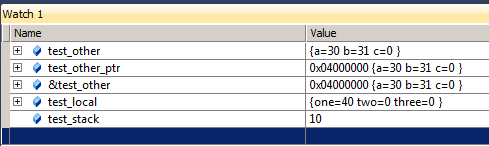
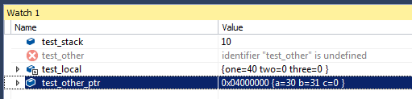
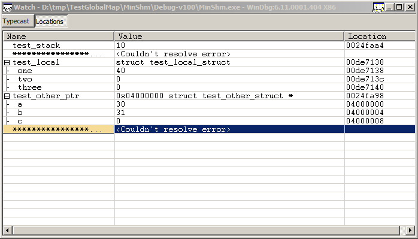
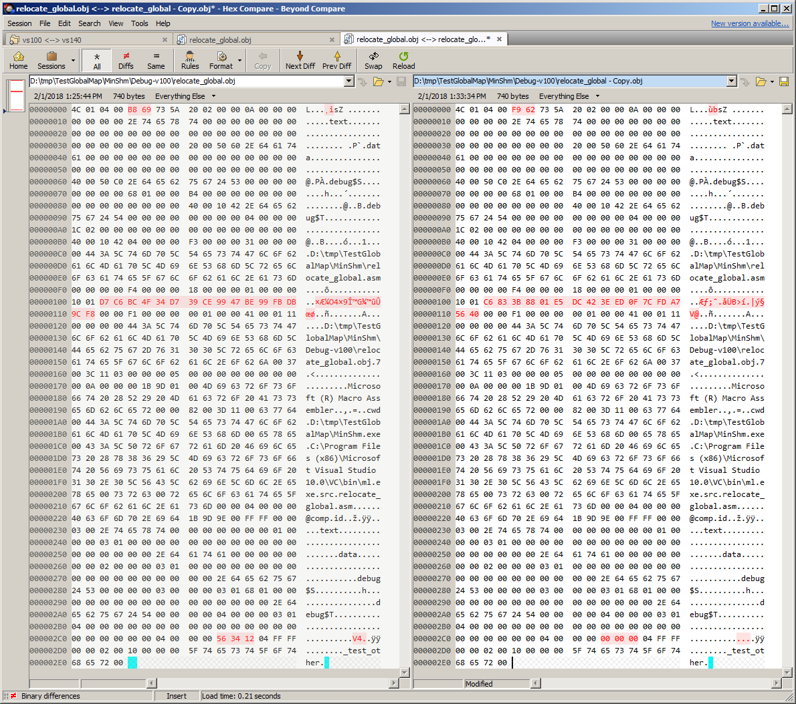

Inability to debug symbols in manually located shared memory for >VS2010
========================================================================

We have a program that we have had for +20 years that uses shared memory. It
is currently running fine in Visual Studio 2010, and we are attempting to
upgrade it to Visual Studio 2015. The upgrade appears to have run successfully,
the **program executes correctly** after running the conversion. However, we are
not able to see the state of variables that are located in a shared memory 
block within the debugger. 

We attach to the shared memory in a normal way:

    #define SHM_ADDRESS 0x04000000
    #define SHM_SIZE_BYTES 1024
    #define SHM_NAME L"TEST_NAME"
    void AttachShm()
    {
       HANDLE mapfile = CreateFileMapping(
          INVALID_HANDLE_VALUE,  // current file handle (use System page file)
          NULL,                  // default security (not inheritable)
          PAGE_READWRITE,        // read/write permission
          0,                     // size of File (high-order doubleword)
          SHM_SIZE_BYTES,        // size of File (low-order doubleword)
          SHM_NAME);             // name of mapping object

       MapViewOfFileEx(
          mapfile,               // handle to mapping object
          FILE_MAP_ALL_ACCESS,   // read/write permission
          0,                     // address offset (high-order doubleword)
          0,                     // address offset (low-order doubleword)
          SHM_SIZE_BYTES,        // size of common block
          (LPVOID)SHM_ADDRESS);  // suggested starting address
    }
    
However, we don't directly use the address as a pointer in our C++ code, 
instead we define an extern struct

    extern "C"
    {
        extern struct test_other_struct {
            int a;
            int b;
            int c;
        } test_other;
    }
    
Then we use some custom masm to locate that at the address

      .586
      .MODEL FLAT
      PUBLIC _test_other
      _test_other = 04000000h
      END

When we run our code:
    
    int main(int argc, char* argv[])
    {
       AttachShm();

       // Local variable always viewable in debugger
       int test_stack = 10;

       // This works (viewable from other program in shm block) 
       // but can't be viewed in the debugger for >VS2010
       test_other.a = 30; 
       
       // Global extern "C" struct, always viewable in debugger
       test_local.one = 40;

       test_other_struct* test_other_ptr = reinterpret_cast<test_other_struct*>(SHM_ADDRESS);
       // This works and can be viewed in all VS versions
       test_other_ptr->b = 31; 

       // Put a breakpoint on the next line, view test_other.a in watch window
       return 0;
    }
    
It executes correctly (in Visual Studio 2010, 2012, 2013, 2015, and 2017). The 
issue is when we put a break point at the `return 0;` line, then put a watch 
on the four items (`test_stack`, `test_other`, `test_local`, and 
`test_other_ptr`). 

For Visual Studio 2010, the watch window shows the correct values 
for all four items, and the structs (and pointer) can be expanded to view the 
internal values.

For Visual Studio 2012, 2013, 2015, and 2017, the watch windows shows the 
correct value for all the items except the `test_other` from the shared memory 
block. They show this as `identifier "test_other" is undefined`.

**I believe this is a bug in the debugger that has shipped with versions of 
visual studio >VS2010.**

I have included details on more steps I took to verify this below.

Cross-Debugging
===============

Starting the VS2010 binary then attaching to it with VS2015 or VS2017 also 
causes the debugger not to be able to view the variable located in the shared 
memory.

Conversly, starting a VS2015 binary and attaching to it with VS2010's debgger
*does* allow it to see the variable located in the shared memory. I was unable
to attach to the VS2017 binary and view the symbols at all from VS2010 (has the
PDB format changed?).

Additionally, when running in VS2015, I am able to change the 
`Tools -> Options -> Debugging -> General -> Use Native Compatibility Mode`
setting and then see the variable in shared memory. Documentation indicates
that this is actually using the VS2010 debugger under the hood, and lacks the 
other improvements that have been made to the debugger, so is not a long-term
solution.

I also tried to open the VS2010 binary in WinDbg, but it wasn't able to
identify the shared memory symbol either.

These steps really point towards this being an issue with the debugger, instead
of some build difference between visual studio versions.

Dumpbin looking for the "test" string
=====================================

    D:\tmp\TestGlobalMap\MinShm>"c:\Program Files (x86)\Microsoft Visual Studio 14.0\vc\bin\dumpbin.exe" /all Debug-v100\MinShm.exe | "C:\Program Files\Git\usr\bin\grep.exe" test
         496  HIGHLOW            00417138  _test_local
    
    D:\tmp\TestGlobalMap\MinShm>"c:\Program Files (x86)\Microsoft Visual Studio 14.0\vc\bin\dumpbin.exe" /all Debug-v110\MinShm.exe | "C:\Program Files\Git\usr\bin\grep.exe" test
         4B6  HIGHLOW            00418130  _test_local
    
    D:\tmp\TestGlobalMap\MinShm>"c:\Program Files (x86)\Microsoft Visual Studio 14.0\vc\bin\dumpbin.exe" /all Debug-v120\MinShm.exe | "C:\Program Files\Git\usr\bin\grep.exe" test
         4A6  HIGHLOW            00418130  _test_local
    
    D:\tmp\TestGlobalMap\MinShm>"c:\Program Files (x86)\Microsoft Visual Studio 14.0\vc\bin\dumpbin.exe" /all Debug-v140\MinShm.exe | "C:\Program Files\Git\usr\bin\grep.exe" test
         776  HIGHLOW            00418138  _test_local
    
    D:\tmp\TestGlobalMap\MinShm>"c:\Program Files (x86)\Microsoft Visual Studio 14.0\vc\bin\dumpbin.exe" /all Debug-v141\MinShm.exe | "C:\Program Files\Git\usr\bin\grep.exe" test
         7B6  HIGHLOW            00419138  _test_local
     

Hex of relocate_global.obj
==========================
     
Here's the hex dump of the end of relocate_global.obj, including the symbol 
and its address 
     
    0270   00 00 00 00 00 00 00 00 00 00 2E 64 65 62 75 67  ...........debug
    0280   24 53 00 00 00 00 03 00 00 00 03 01 68 01 00 00  $S..........h...
    0290   00 00 00 00 00 00 00 00 00 00 00 00 00 00 2E 64  ...............d
    02A0   65 62 75 67 24 54 00 00 00 00 04 00 00 00 03 01  ebug$T..........
    02B0   04 00 00 00 00 00 00 00 00 00 00 00 00 00 00 00  ................
    02C0   00 00 00 00 00 00 04 00 00 00 00 00 00 04 FF FF  ..............ÿÿ
    02D0   00 00 02 00 10 00 00 00 5F 74 65 73 74 5F 6F 74  ........_test_ot
    02E0   68 65 72 00                                      her.

This was confirmed by changeing the address in relocate_global.asm to:

      PUBLIC _test_other
      _test_other = 04123456h
      ;_test_other = 04000000h
      
And viewing the resulting hex:

    02C0   00 00 00 00 00 00 04 00 00 00 56 34 12 04 FF FF  ..........V4..ÿÿ
    02D0   00 00 02 00 10 00 00 00 5F 74 65 73 74 5F 6F 74  ........_test_ot
    02E0   68 65 72 00                                      her.

I was able to use a similar method to determin that this symbol was making it 
into the .pdb in some manner. However each of VS2010, VS2015, and VS2017 
seemed to have done things differently, with different locations in the PDB 
and different amounts of the differences. 

DBH Tool Output
===============

I was able to use the dbh tool to find the test_other symbol, looks the same 
in VS2010 and VS2015, VS2017 seems to not be compatible with dbh.

    D:\tmp\TestGlobalMap\MinShm>dbh Debug-v100\MinShm.pdb name test_other
    
       name : test_other
       addr :  4000000
       size : 0
      flags : 0
       type : 0
    modbase :  1000000
      value :        0
        reg : 0
      scope : SymTagPublicSymbol (a)
        tag : SymTagPublicSymbol (a)
      index : 3
    
     
    D:\tmp\TestGlobalMap\MinShm>dbh Debug-v140\MinShm.pdb name test_other
    
       name : test_other
       addr :  4000000
       size : 0
      flags : 0
       type : 0
    modbase :  1000000
      value :        0
        reg : 0
      scope : SymTagPublicSymbol (a)
        tag : SymTagPublicSymbol (a)
      index : 
    
    D:\tmp\TestGlobalMap\MinShm>dbh Debug-v141\MinShm.pdb name test_other
    
    no symbol found
    
    D:\tmp\TestGlobalMap\MinShm>dbh Debug-v100\MinShm.pdb name test_local
    
       name : test_local
       addr :  1017138
       size : c
      flags : 0
       type : 2
    modbase :  1000000
      value :        0
        reg : 0
      scope : SymTagExe (1)
        tag : SymTagData (7)
      index : 1
    
    D:\tmp\TestGlobalMap\MinShm>dbh Debug-v140\MinShm.pdb name test_local
    
       name : test_local
       addr :  1018138
       size : c
      flags : 0
       type : 2
    modbase :  1000000
      value :        0
        reg : 0
      scope : SymTagExe (1)
        tag : SymTagData (7)
      index : 1
    
    D:\tmp\TestGlobalMap\MinShm>dbh Debug-v141\MinShm.pdb name test_local
    
    no symbol found
    
    
Looking in the Disassembly
==========================

The disassembly shown while debugging is below, the key line is the same for 
each VS version:

       test_other.a = 30; 
    000717AA  mov         dword ptr ds:[4000000h],1Eh  

VS2010
------

    int main(int argc, char* argv[])
    {
       AttachShm();
    00DE147E  call        AttachShm (0DE10AFh)  
    
       // Local variable always viewable in debugger
       int test_stack = 10;
    00DE1483  mov         dword ptr [test_stack],0Ah  
    
       // This works (viewable from other program in shm block) 
       // but can't be viewed in the debugger for >VS2010
       test_other.a = 30; 
    00DE148A  mov         dword ptr ds:[4000000h],1Eh  
       
       // Global extern "C" struct, always viewable in debugger
       test_local.one = 40;
    00DE1494  mov         dword ptr [_test_local (0DE7138h)],28h  
    
       test_other_struct* test_other_ptr = reinterpret_cast<test_other_struct*>(SHM_ADDRESS);
    00DE149E  mov         dword ptr [test_other_ptr],4000000h  
       // This works and can be viewed in all VS versions
       test_other_ptr->b = 31; 
    00DE14A5  mov         eax,dword ptr [test_other_ptr]  
    00DE14A8  mov         dword ptr [eax+4],1Fh  
    
       // Put a breakpoint on the next line, view test_other.a in watch window
       return 0;
    }

VS2015
------

       AttachShm();
    0036175E  call        AttachShm (036119Fh)  
    
       // Local variable always viewable in debugger
       int test_stack = 10;
    00361763  mov         dword ptr [test_stack],0Ah  
    
       // This works (viewable from other program in shm block) 
       // but can't be viewed in the debugger for >VS2010
       test_other.a = 30; 
    0036176A  mov         dword ptr ds:[4000000h],1Eh  
       
       // Global extern "C" struct, always viewable in debugger
       test_local.one = 40;
    00361774  mov         dword ptr [test_local (0368138h)],28h  
    
       test_other_struct* test_other_ptr = reinterpret_cast<test_other_struct*>(SHM_ADDRESS);
    0036177E  mov         dword ptr [test_other_ptr],4000000h  
       // This works and can be viewed in all VS versions
       test_other_ptr->b = 31; 
    00361785  mov         eax,dword ptr [test_other_ptr]  
    00361788  mov         dword ptr [eax+4],1Fh  
    
       // Put a breakpoint on the next line, view test_other.a in watch window
       return 0;
   
   
VS2017
------

       AttachShm();
    0007179E  call        AttachShm (0711B3h)  
    
       // Local variable always viewable in debugger
       int test_stack = 10;
    000717A3  mov         dword ptr [test_stack],0Ah  
    
       // This works (viewable from other program in shm block) 
       // but can't be viewed in the debugger for >VS2010
       test_other.a = 30; 
    000717AA  mov         dword ptr ds:[4000000h],1Eh  
       
       // Global extern "C" struct, always viewable in debugger
       test_local.one = 40;
    000717B4  mov         dword ptr [test_local (079138h)],28h  
    
       test_other_struct* test_other_ptr = reinterpret_cast<test_other_struct*>(SHM_ADDRESS);
    000717BE  mov         dword ptr [test_other_ptr],4000000h  
       // This works and can be viewed in all VS versions
       test_other_ptr->b = 31; 
    000717C5  mov         eax,dword ptr [test_other_ptr]  
    000717C8  mov         dword ptr [eax+4],1Fh  
    
       // Put a breakpoint on the next line, view test_other.a in watch window
       return 0;   
   
